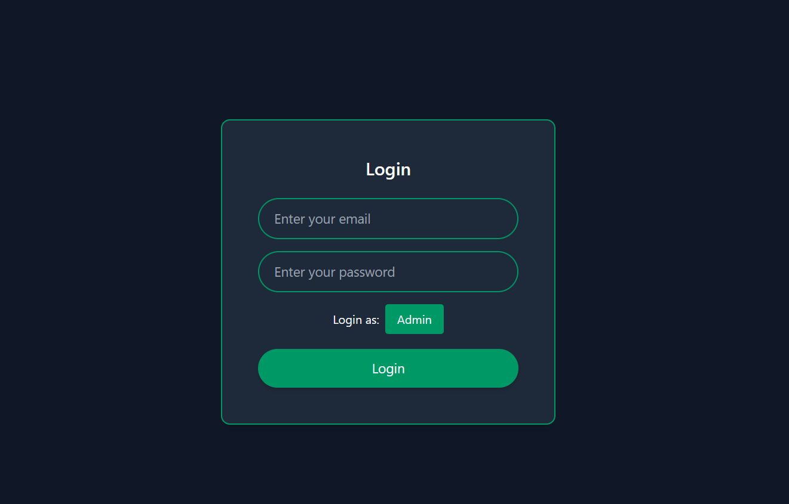
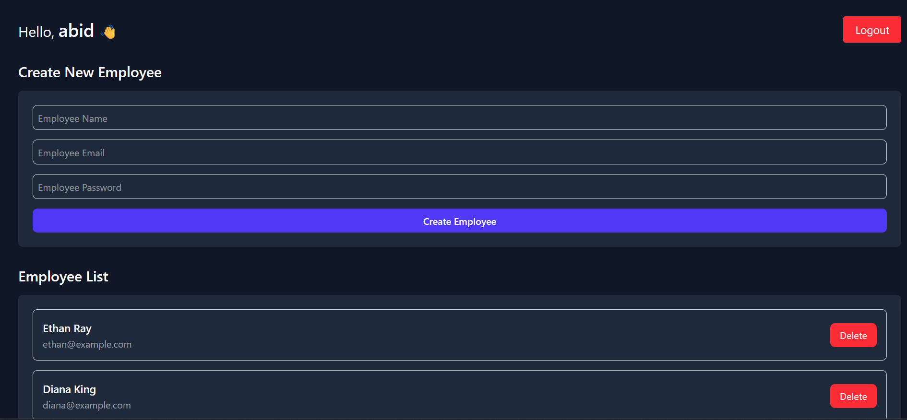
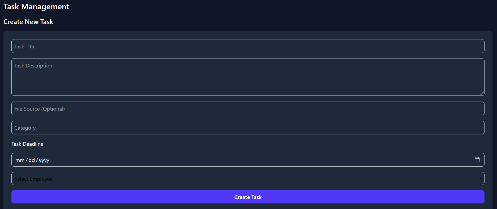
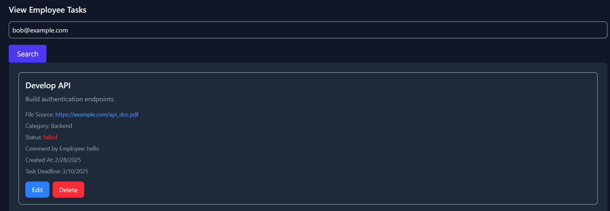
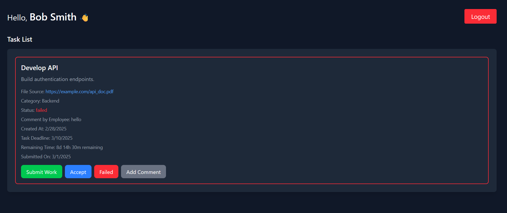

# Employee Management System (EMS)

  
🚀 **EMS** is a web-based application designed to streamline employee management for organizations. It enables adding, updating, deleting, and viewing employee details, as well as tracking tasks and generating reports.

---

## 📌 Table of Contents

- [Features](#features)
- [Technologies Used](#technologies-used)
- [Installation](#installation)
- [Usage](#usage)
- [API Documentation](#api-documentation)
- [Demo Screenshots](#demo-screenshots)
- [Contributing](#contributing)
- [License](#license)
- [Contact](#contact)

---

## ✨ Features

✅ **Employee Management**: Add, update, delete, and view employee details.  
✅ **Task Management**: Assign, update, and track employee tasks.  
✅ **Search Functionality**: Search for employee tasks by email.  
✅ **User Authentication**: Secure login system for both admin and employees.  
✅ **Responsive Design**: Optimized for both desktop and mobile devices.  

---

## 🛠 Technologies Used

- **Frontend**: HTML, CSS, JavaScript, React.js, Vite
- **Backend**: Node.js, Express.js, Dotenv, Bcrypt.js
- **Database**: MongoDB
- **Authentication**: JSON Web Tokens (JWT) *(Future Planning)*
- **Hosting**: Render, Vercel
- **Other Tools**: Git, Postman

---

## ⚙️ Installation

Follow these steps to set up the project locally:

### 🖥️ Clone the repository
```bash
 git clone https://github.com/abidsarkar/Employee-Management-System-MERN-Stack.git
 cd Employee-Management-System-MERN-Stack
```

### 📡 Backend Setup

1. **Install dependencies:**
    ```bash
    cd EMS-backend
    npm install
    ```

2. **Set up environment variables:**
    - Create a `.env` file in the root directory and add:
    ```bash
    PORT=3000
    MONGODB_URI=your_mongodb_connection_string
    ```

3. **Run the backend server:**
    ```bash
    npm start
    ```
    or
    ```bash
    npm run dev
    ```

### 🎨 Frontend Setup

1. **Install dependencies:**
    ```bash
    cd EMS-frontend
    npm install
    ```

2. **Set up environment variables:**
    - Create a `.env` file in the root directory and add:
    ```bash
    VITE_BACKEND_URL=your_backend_localhost_link
    ```

3. **Run the frontend:**
    ```bash
    npm run dev
    ```

4. **Access the app:**  
   Open your browser and navigate to: [http://localhost:5173](http://localhost:5173)

---

## 🚀 Usage

🔹 **Admin Login**: Log in to manage employees.  
🔹 **Add Employee**: Fill out the form to register a new employee.  
🔹 **Edit Employee**: Modify employee details with the edit option.  
🔹 **Delete Employee**: Remove an employee from the system.  
🔹 **Assign Tasks**: Assign new tasks to employees.  
🔹 **Update Tasks**: Modify or track the progress of assigned tasks.  
🔹 **Employee Dashboard**: Employees can log in to view and update their tasks.

---

## 📡 API Documentation

| Method | Endpoint | Description |
|--------|----------|-------------|
| GET | `/employees` | Fetch all employees |
| GET | `/employees/:email/tasks` | Fetch tasks for a specific employee |
| POST | `/employees` | Create a new employee |
| POST | `/employees/:email/tasks` | Assign a task to an employee |
| PUT | `/employees/:email/tasks/:taskId` | Update task details |
| PUT | `/employees/:email/tasks/:taskId/submit` | Submit a task |
| DELETE | `/employees/:email/tasks/:taskId` | Delete a specific task |
| DELETE | `/employees/:email` | Delete an employee |

---

## 📸 Demo Screenshots
## 🏠 Login page

### 🏢 Admin Panel


### 📋 Create Task


### 👀 View Employee Tasks


### 👤 Employee Dashboard


---

## 🤝 Contributing

Contributions are welcome! To contribute:
1. Fork the repository.
2. Create a new branch: `git checkout -b feature-branch`.
3. Commit your changes: `git commit -m 'Add some feature'`.
4. Push to the branch: `git push origin feature-branch`.
5. Open a Pull Request.

---

## 📜 License

This project is licensed under the [MIT License](LICENSE).

---

## 📞 Contact

For any inquiries, feel free to reach out:
- **GitHub**: [abidsarkar](https://github.com/abidsarkar)
- **Email**: abidsarker.61@gamil.com
- **LinkedIn**:[abidsarkar](https://www.linkedin.com/in/md-abid-sarkar-556903290)

---

🚀 **Let's build an efficient Employee Management System together!**

